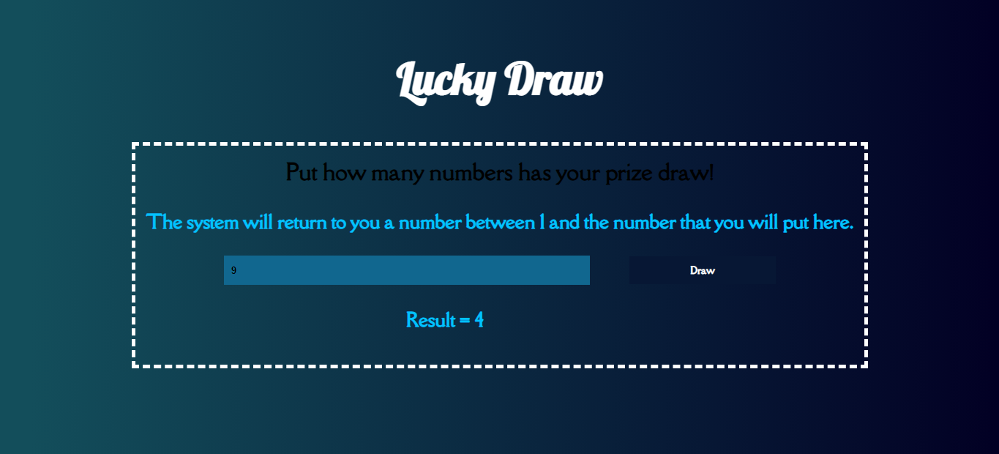
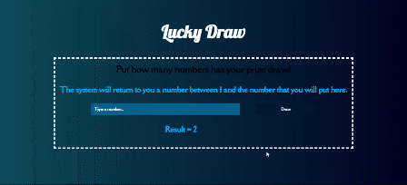

<h1>Lucky Draw</h1>
 

This simple and responsive lucky draw system is a project to exercise, apply and increase my HTML, CSS and JAVASCRIPT knowleadge. It can be useful for choose a winner in a prize draw with X amount of people, for example.

 
<h2>Preview</h2>

 

 
  <h2>Technologies used</h2>
   
  
  

 

 
  <h2>Demo Preview</h2> 
  
   

  

Live Demo: https://luckydrawlbn.netlify.app/
